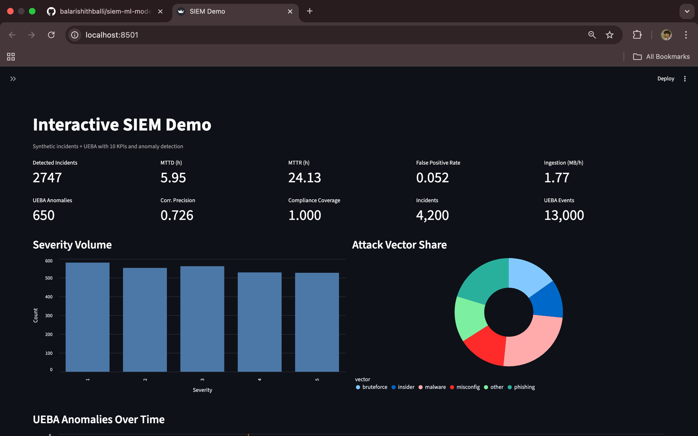
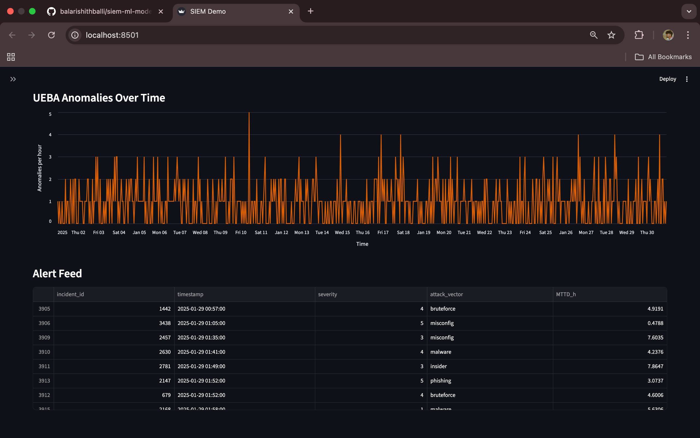
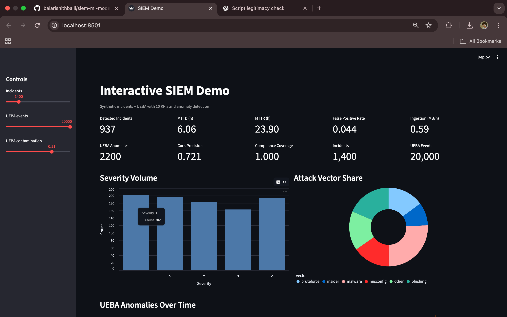
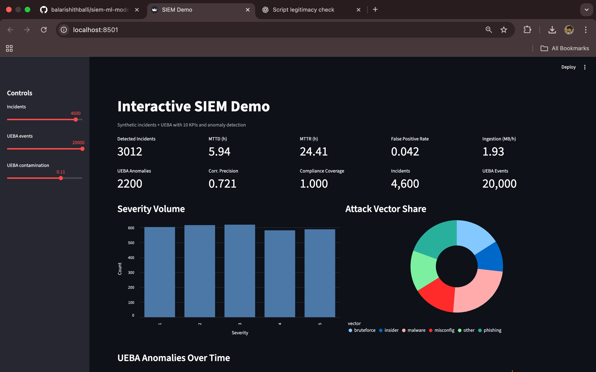

# Interactive SIEM Demo

A synthetic **Security Information and Event Management (SIEM)** dashboard built with **Streamlit**.  
It simulates security incidents, user/entity behavior events (UEBA), and provides anomaly detection + key metrics in real time.

---
## 📸 Preview

### Dashboard Overview


### UEBA Anomalies Over Time

### CONTROLLERS

 

## 🚀 Features

- **Synthetic Data Generators**
  - `make_incidents`: Generates realistic security incident logs (timestamps, severity, attack vectors, compliance controls, ingestion rates, etc.).
  - `make_ueba`: Simulates UEBA events (user behavior scores, failed logins, sensitive access, etc.) with anomaly detection via [PyOD](https://pyod.readthedocs.io/).

- **Key Metrics (KPIs)**
  - Detected Incidents
  - Mean Time To Detect (MTTD)
  - Mean Time To Respond (MTTR)
  - False Positive Rate (FPR)
  - Log Ingestion (MB/hour)
  - UEBA Anomalies
  - Correlation Precision
  - Compliance Coverage

- **Visualizations**
  - Severity distribution (bar chart)
  - Attack vector share (pie chart)
  - UEBA anomalies over time (line chart)
  - Live alert feed table

- **Interactive Controls**
  - Adjust number of incidents, UEBA events, and anomaly contamination level from the sidebar.

---

## 📦 Installation

Clone the repository:

```bash
https://github.com/balarishithballi/siem-ml-model1
cd siem-demo
```

Create and activate a virtual environment (recommended):

```bash
python3 -m venv venv
source venv/bin/activate   # On Windows: venv\Scripts\activate
```

Install dependencies:

```bash
pip install -r requirements.txt
```

---

## ▶️ Usage

Run the Streamlit app:

```bash
streamlit run app.py
```

Then open the link shown in your terminal (usually [http://localhost:8501](http://localhost:8501)).

---

## 📊 Example Dashboard

- KPI tiles with detection, response, and anomaly stats  
- Altair charts for severity, attack vectors, and anomalies over time  
- Live alert feed for the latest incidents  

---

## 🛠 Requirements

- Python 3.8+
- Streamlit
- Numpy / Pandas
- Scikit-learn
- PyOD
- Altair

(See [`requirements.txt`](requirements.txt) for exact versions.)

---

## 📄 License

MIT License – feel free to fork, modify, and use for learning or demos.
